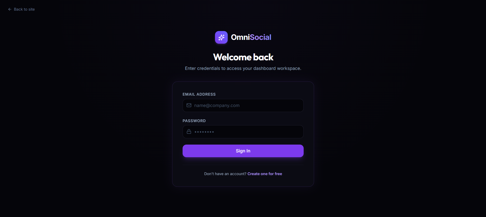
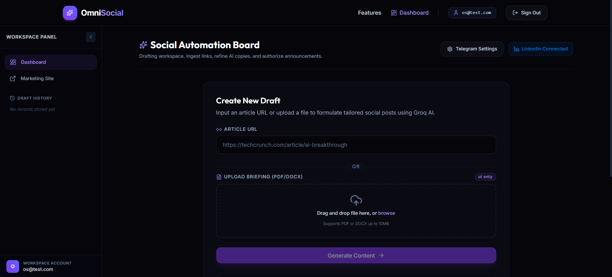
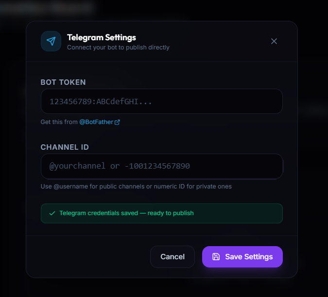
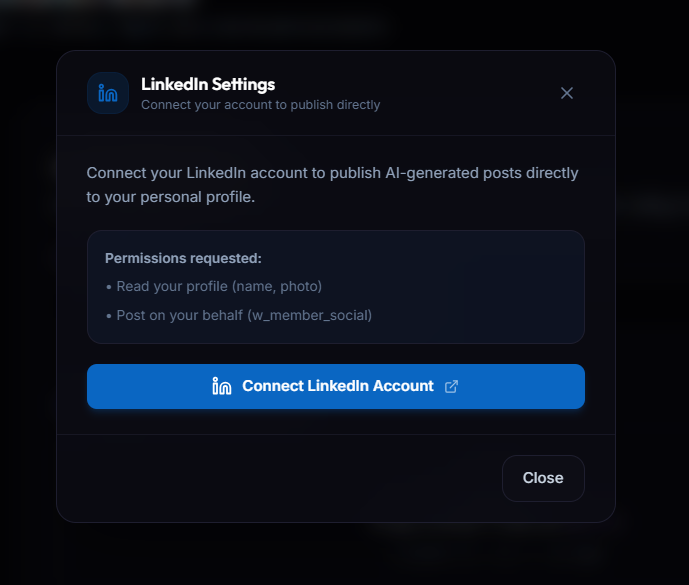
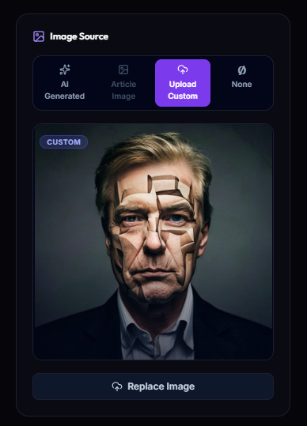

# OmniSocial

> AI-powered social media automation platform. Paste an article URL, get publish-ready LinkedIn and Telegram posts in seconds — with one-click publishing to your connected accounts.

### 🌐 Live Demo: [omni-social.vercel.app](https://omni-social.vercel.app)

---

## Screenshots

### Login


### Dashboard


### Telegram Settings


### LinkedIn Settings


### Image Source


---

## What it does

1. User pastes an article URL
2. n8n extracts the article content and scrapes the OG image
3. Groq AI generates platform-optimised posts for LinkedIn and Telegram
4. User reviews and edits the generated content
5. User selects an image source (AI-generated, article image, custom upload, or none)
6. User publishes directly to LinkedIn and/or Telegram with one click

---

## Tech Stack

| Layer | Technology |
|---|---|
| Frontend | React 18 + Vite |
| Styling | TailwindCSS (dark SaaS theme) |
| Auth | Firebase Authentication (Email/Password) |
| Database | Firebase Firestore |
| Automation | n8n (self-hosted or cloud) |
| AI | Groq API (LLaMA 3) |
| AI Images | Pollinations AI |
| LinkedIn OAuth | LinkedIn OAuth 2.0 |
| Hosting | Vercel |

---

## Project Structure

```
src/
├── components/
│   ├── FeatureCards.jsx          # Landing page feature grid
│   ├── GenerateForm.jsx          # Article URL input form
│   ├── Hero.jsx                  # Landing page hero section
│   ├── LinkedInSettingsModal.jsx # LinkedIn connect/disconnect UI
│   ├── LoadingSpinner.jsx        # Animated loading states
│   ├── Navbar.jsx                # Top navigation bar
│   ├── ProtectedRoute.jsx        # Auth guard for dashboard
│   ├── ResultCards.jsx           # Content editor + image selector + publish
│   ├── Sidebar.jsx               # Draft history panel
│   └── TelegramSettingsModal.jsx # Telegram bot token + channel ID form
├── firebase/
│   └── config.js                 # Firebase app initialisation
├── hooks/
│   ├── useAuth.jsx               # AuthProvider + login/register/logout
│   └── useUserSettings.jsx       # Load/save user platform credentials
├── layouts/
│   └── MainLayout.jsx            # Landing page layout wrapper
├── pages/
│   ├── Dashboard.jsx             # Main workspace
│   ├── LandingPage.jsx           # Public marketing page
│   ├── LinkedInCallback.jsx      # LinkedIn OAuth callback handler
│   ├── Login.jsx                 # Login page
│   └── Register.jsx              # Registration page
└── services/
    ├── api.js                    # n8n webhook calls (generate + publish)
    └── userSettings.js           # Firestore read/write for user settings
```

---

## Environment Variables

Create a `.env` file in the project root:

```env
# Firebase
VITE_FIREBASE_API_KEY=
VITE_FIREBASE_AUTH_DOMAIN=
VITE_FIREBASE_PROJECT_ID=
VITE_FIREBASE_STORAGE_BUCKET=
VITE_FIREBASE_MESSAGING_SENDER_ID=
VITE_FIREBASE_APP_ID=

# n8n Webhooks
VITE_N8N_WEBHOOK_URL=https://your-n8n.app.n8n.cloud/webhook/generate-content
VITE_N8N_TELEGRAM_PUBLISH_URL=https://your-n8n.app.n8n.cloud/webhook/publish-telegram
VITE_N8N_LINKEDIN_TOKEN_URL=https://your-n8n.app.n8n.cloud/webhook/linkedin-token
VITE_N8N_LINKEDIN_PUBLISH_URL=https://your-n8n.app.n8n.cloud/webhook/publish-linkedin

# LinkedIn OAuth
VITE_LINKEDIN_CLIENT_ID=
VITE_LINKEDIN_REDIRECT_URI=https://omni-social.vercel.app/linkedin/callback
```

---

## Getting Started

```bash
# Install dependencies
npm install

# Start development server
npm run dev

# Build for production
npm run build
```

---

## n8n Workflows

OmniSocial uses four n8n workflows. Each is a separate webhook-triggered automation.

---

### Workflow 1 — Content Generation

**Webhook path:** `POST /webhook/generate-content`

**Request body:**
```json
{ "url": "https://example.com/article" }
```

**Flow:**
```
Webhook
  └─► HTTP Request (fetch article HTML)
        └─► Code node (extract og:image, twitter:image, first  fallback)
              └─► AI Agent / Groq (generate LinkedIn + Telegram posts + hashtags)
                    └─► Set node (format response)
                          └─► Respond to Webhook
```

**Response:**
```json
{
  "linkedin": "Generated LinkedIn post text...",
  "telegram": "Generated Telegram post text...",
  "hashtags": ["#AI", "#Automation", "#SaaS"],
  "image": "https://example.com/og-image.jpg"
}
```

**Image extraction logic (Code node):**
```javascript
const html = items[0].json.html || '';
let imageUrl = null;

// 1. og:image
const ogMatch = html.match(/<meta[^>]+property=["']og:image["'][^>]+content=["']([^"']+)["']/i)
             || html.match(/<meta[^>]+content=["']([^"']+)["'][^>]+property=["']og:image["']/i);
if (ogMatch) imageUrl = ogMatch[1];

// 2. twitter:image
if (!imageUrl) {
  const twMatch = html.match(/<meta[^>]+name=["']twitter:image["'][^>]+content=["']([^"']+)["']/i);
  if (twMatch) imageUrl = twMatch[1];
}

// 3. First large  fallback
if (!imageUrl) {
  const imgMatch = html.match(/]+src=["'](https?:\/\/[^"']+\.(?:jpg|jpeg|png|webp)[^"']*)["']/i);
  if (imgMatch) imageUrl = imgMatch[1];
}

return [{ json: { ...items[0].json, image: imageUrl } }];
```

---

### Workflow 2 — Telegram Publishing

**Webhook path:** `POST /webhook/publish-telegram`

**Request:** `multipart/form-data`

| Field | Type | Description |
|---|---|---|
| `telegram` | string | Post caption text |
| `botToken` | string | Telegram bot token |
| `channelId` | string | Channel username or numeric ID |
| `imageUrl` | string (optional) | URL for AI/article image |
| `imageFile` | binary (optional) | Uploaded custom image file |

**Flow:**
```
Webhook
  └─► IF: $binary.imageFile exists?
        TRUE  └─► Telegram node (Send Photo — binary upload)
                    Caption: {{ $json.body.telegram }}
        FALSE └─► IF: $json.body.imageUrl is not empty?
                    TRUE  └─► Telegram node (Send Photo with URL)
                    FALSE └─► Telegram node (Send Message — text only)
```

> ⚠️ Use n8n's native **Telegram node** instead of HTTP Request nodes to avoid JSON serialisation issues with multi-line text.

---

### Workflow 3 — LinkedIn OAuth Token Exchange

**Webhook path:** `POST /webhook/linkedin-token`

**Request body:**
```json
{
  "code": "AQT...",
  "redirectUri": "https://omni-social.vercel.app/linkedin/callback"
}
```

**Flow:**
```
Webhook
  └─► HTTP Request (POST https://www.linkedin.com/oauth/v2/accessToken)
        Form body: grant_type=authorization_code
                   code={{ $json.body.code }}
                   redirect_uri={{ $json.body.redirectUri }}
                   client_id=YOUR_CLIENT_ID
                   client_secret=YOUR_CLIENT_SECRET
        └─► HTTP Request (GET https://api.linkedin.com/v2/userinfo)
              Headers: Authorization: Bearer {{ $json.access_token }}
              └─► Set node
                    └─► Respond to Webhook
```

**Response:**
```json
{
  "accessToken": "AQV...",
  "personId": "Om9yLg8fF2"
}
```

---

### Workflow 4 — LinkedIn Publishing

**Webhook path:** `POST /webhook/publish-linkedin`

**Request:** JSON or `multipart/form-data` depending on `postType`

| Field | Type | Description |
|---|---|---|
| `postType` | `"text"` \| `"ai-image"` \| `"image"` | Routing signal for n8n IF node |
| `linkedin` | string | Post text content |
| `hashtags` | JSON string | `'["#AI","#Tech"]'` — parse with `JSON.parse()` in n8n |
| `accessToken` | string | LinkedIn OAuth token |
| `personId` | string | LinkedIn person ID (not full URN) |
| `imageUrl` | string (optional) | For `ai-image` postType |
| `imageFile` | binary (optional) | For `image` postType |

**Flow:**
```
Webhook
  └─► IF: $json.body.postType === "text"
        TRUE  └─► HTTP Request (LinkedIn ugcPosts — text only)
        FALSE └─► IF: $json.body.postType === "image" AND $binary.imageFile exists?
                    TRUE  └─► LinkedIn Register Upload
                                └─► HTTP Request (upload binary to uploadUrl)
                                      └─► HTTP Request (ugcPost with asset URN)
                    FALSE └─► HTTP Request (download imageUrl)
                                └─► LinkedIn Register Upload
                                      └─► HTTP Request (upload image)
                                            └─► HTTP Request (ugcPost with asset URN)
```

**LinkedIn text-only ugcPost body:**
```json
{
  "author": "urn:li:person:{{ $json.body.personId }}",
  "lifecycleState": "PUBLISHED",
  "specificContent": {
    "com.linkedin.ugc.ShareContent": {
      "shareCommentary": {
        "text": "{{ $json.body.linkedin }}"
      },
      "shareMediaCategory": "NONE"
    }
  },
  "visibility": {
    "com.linkedin.ugc.MemberNetworkVisibility": "PUBLIC"
  }
}
```

**LinkedIn image ugcPost body:**
```json
{
  "author": "urn:li:person:{{ $json.body.personId }}",
  "lifecycleState": "PUBLISHED",
  "specificContent": {
    "com.linkedin.ugc.ShareContent": {
      "shareCommentary": { "text": "{{ $json.body.linkedin }}" },
      "shareMediaCategory": "IMAGE",
      "media": [{ "status": "READY", "media": "{{ assetUrn }}" }]
    }
  },
  "visibility": {
    "com.linkedin.ugc.MemberNetworkVisibility": "PUBLIC"
  }
}
```

---

## Image Source Selector

| Option | Behaviour | Sent to n8n |
|---|---|---|
| **AI Generated** | Pollinations AI URL built from post content | `imageUrl` (string) |
| **Article Image** | OG image extracted by n8n during generation | `imageUrl` (string) |
| **Upload Custom** | User picks a local file, previewed instantly | `imageFile` (binary) |
| **None** | No image attached | neither field sent |

---

## LinkedIn OAuth Flow

```
User clicks "Connect LinkedIn"
  └─► Redirect to LinkedIn OAuth authorization URL
        scope: openid profile email w_member_social

LinkedIn redirects to:
  https://omni-social.vercel.app/linkedin/callback?code=AQT...
  └─► Frontend POSTs code to n8n /webhook/linkedin-token
        └─► n8n exchanges code → accessToken + personId
              └─► Saved to Firestore userSettings/{uid}.linkedin
                    └─► Redirect to /dashboard
```

---

## Firestore Data Model

**Collection: `userSettings/{uid}`**
```json
{
  "botToken": "123456789:ABC...",
  "channelId": "@yourchannel",
  "linkedin": {
    "accessToken": "AQV...",
    "personId": "Om9yLg8fF2",
    "connected": true
  }
}
```

**Collection: `drafts/{docId}`**
```json
{
  "userId": "firebase-uid",
  "url": "https://example.com/article",
  "linkedin": "Generated LinkedIn post...",
  "telegram": "Generated Telegram post...",
  "hashtags": ["#AI", "#Automation"],
  "articleImage": "https://example.com/og.jpg",
  "aiImage": "https://image.pollinations.ai/prompt/...",
  "createdAt": 1716000000000,
  "dateLabel": "May 18, 02:30 PM"
}
```

---

## Firebase Setup

1. Create a project at [console.firebase.google.com](https://console.firebase.google.com)
2. Enable **Authentication → Email/Password**
3. Enable **Firestore Database**
4. Add your web app and copy config values to `.env`
5. Go to **Authentication → Settings → Authorized domains** and add:
   ```
   omni-social.vercel.app
   ```
6. Set Firestore security rules:

```
rules_version = '2';
service cloud.firestore {
  match /databases/{database}/documents {
    match /userSettings/{uid} {
      allow read, write: if request.auth != null && request.auth.uid == uid;
    }
    match /drafts/{docId} {
      allow read, write: if request.auth != null && request.auth.uid == resource.data.userId;
      allow create: if request.auth != null;
    }
  }
}
```

---

## LinkedIn App Setup

1. Go to [linkedin.com/developers](https://www.linkedin.com/developers/)
2. Create an app — add **Sign In with LinkedIn using OpenID Connect** and **Share on LinkedIn** products
3. Under **Auth → Authorized Redirect URLs** add:
   ```
   https://omni-social.vercel.app/linkedin/callback
   http://localhost:5173/linkedin/callback
   ```
4. Copy Client ID to `VITE_LINKEDIN_CLIENT_ID` in `.env`
5. Store Client Secret in n8n credentials only — never in the frontend

---

## Deploying to Vercel

### Step 1 — Push to GitHub
```bash
git init && git add . && git commit -m "initial commit"
git remote add origin https://github.com/YOUR_USERNAME/omnisocial.git
git push -u origin main
```

### Step 2 — Import on Vercel
1. Go to [vercel.com/new](https://vercel.com/new) → Import your repo
2. Framework auto-detected as **Vite** — leave defaults

### Step 3 — Add Environment Variables
Add all variables from `.env` in Vercel project → **Settings → Environment Variables**.
Set `VITE_LINKEDIN_REDIRECT_URI` to:
```
https://omni-social.vercel.app/linkedin/callback
```

### Step 4 — Deploy
Click **Deploy**. Live in ~60 seconds at **[omni-social.vercel.app](https://omni-social.vercel.app)**

### Step 5 — Post-deploy checklist
- [ ] Add `omni-social.vercel.app` to Firebase Authorized Domains
- [ ] Add production redirect URI to LinkedIn app
- [ ] Set CORS on n8n publish webhooks to allow `https://omni-social.vercel.app`
- [ ] Re-enter Telegram settings on production site
- [ ] Reconnect LinkedIn on production site

---

## Known Limitations

- LinkedIn access tokens expire after 60 days — reconnect via the LinkedIn Settings button
- Multi-line AI-generated text can break n8n JSON body nodes — use native Telegram/HTTP nodes with field mode instead of raw JSON
- PDF/DOCX file upload in the generate form is UI-only (generates mock content)
- Article image extraction depends on the target site having proper OG meta tags
